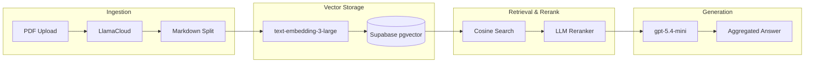

# Vectera.ai RAG System

This repository contains a specialized Retrieval-Augmented Generation (RAG) pipeline built to ingest messy financial PDFs, store high-dimensional embeddings, and execute citation-aware generation. The system is explicitly optimized to handle the edge cases of real-world enterprise data: conflicting document versions, multi-tenant isolation, and structured financial tables.

## System Architecture

The pipeline consists of a Streamlit frontend and a Python backend, orchestrating LlamaCloud for structural ingestion, Supabase for vector storage, and OpenAI for embedding and generation.



Embedding and reasoning models are configurable via `EMBEDDING_MODEL` and `REASONING_MODEL` (defaults: `text-embedding-3-large`, `gpt-5.4-mini`).
Retrieval depth is configurable via `TOP_K`.

## Core Infrastructure & Trade-Offs

### 1. Database & Multi-Tenancy (Supabase)
Instead of a simple local vector store, I utilized Supabase (Postgres + pgvector) to demonstrate enterprise readiness. 
* **The Multi-Tenant Flex:** The assessment listed client access control as an optional consideration. I implemented a strict `client_id` column in the `documents` table. 
* **Data Segregation (demo):** Streamlit UI exposes a tenant dropdown to test separation. Retrieval uses a Postgres RPC function (`match_documents`) that filters by `client_id`. This is logical segregation only (no auth/RLS yet).

### 2. Chunking & Structured Data Handling
Standard open-source RAG systems destroy financial tables by slicing them mid-row using naive character splitters. 
* **Ingestion:** I route PDF bytes through the `LlamaCloud` SDK (sync parse) on the `agentic` tier. It returns markdown text and tables; inline images are disabled.
* **Chunking:** I used LangChain's `MarkdownTextSplitter` (Size: 2000, Overlap: 400). This protects table structures by explicitly splitting at Markdown headers and tables instead of arbitrary character limits.
* **Ingestion Guards:** Dedup via file hash and text hash. If metadata (company/version) stays `Unknown`, ingestion is skipped.

### 3. Retrieval Strategy
I implemented a two-stage retrieval pipeline to bridge the lexical gap between dense vectors and tabular data.
* **Stage 1 (Vector Search):** We embed the query using `text-embedding-3-large` and pull candidate chunks via cosine similarity in Postgres.
* **Stage 2 (LLM Reranker):** Because dense vectors struggle to prioritize exact keyword matches in financial tables, I built a custom LLM Cross-Encoder Reranker. It acts as a relevance judge, reads the candidate payloads, and passes only the most relevant chunks to the final generation model.

## Handling Real-World Complexity

### Version Awareness & Conflict Resolution
The rubric requires the system to handle multiple versions of the same company's materials without blindly merging conflicting metrics.
* **Retrieval Thresholding:** If the query router detects a comparison query (e.g., "compare Q3 and Q4"), it dynamically drops the similarity threshold to `0.0` and widens the `match_count`. This guarantees we catch chunks from older, less semantically similar document versions.
* **Metadata Injection:** Each retrieved chunk is prefixed with `[Company: ..., Version: ...]`, and context headers include `Source: {document}, Version: {version}`.
* **Prompt Engineering:** The generation model (default `gpt-5.4-mini`) is governed by a strict System Prompt. It is explicitly forbidden from averaging conflicting numbers. It is forced to state: *"Source A says X [A, v1]. Source B says Y [B, v2]."*

### Citations
Citations are generated natively via prompt constraints. No programmatic post-validation or retry loop yet. To avoid "citation spam" inside tabular data, the LLM is instructed to aggregate all `[Document Name, VersionValue]` citations cleanly at the end of the relevant paragraph or below the generated markdown table.

## Known Limitations

* **Parsing Latency:** New documents can take time to parse with LlamaCloud; no explicit caching layer beyond ingestion dedup.
* **Synchronous Processing:** LlamaCloud parsing runs synchronously and blocks the Streamlit UI thread during ingestion. No async queue or background workers yet.
* **Single-Turn Retrieval:** UI keeps chat history, but retrieval does not use prior turns (no query rewrite).
* **Visual Data:** LlamaCloud returns markdown text and tables; inline images are disabled. Chart/graph understanding limited to textual descriptions.

## What I Would Improve With More Time

1.  **Citation Validation & Repair:** Add a post-generation check to ensure every answer includes valid `[Document, Version]` citations; retry or repair when missing.
2.  **Multi-Turn Conversational State:** Standard cosine search fails on conversational follow-ups (e.g., "What about Q4?"). To support true multi-turn chats, I would build a Query Contextualization pipeline. This requires an initial LLM pass to rewrite conversational fragments into standalone, context-complete search queries before hitting the vector database.
3.  **Vector Search Tuning (HNSW):** The current DB uses exact cosine similarity. At scale (millions of chunks), this degrades into a full table scan. I would implement an HNSW (Hierarchical Navigable Small World) index in `pgvector` to drop retrieval latency, trading a negligible amount of accuracy for massive speed gains.
4.  **Production Row Level Security (RLS):** While multi-tenancy is handled via RPC parameters for this MVP, a true production environment would enforce Supabase RLS policies (e.g., `using (auth.uid() = tenant_id)`) to physically isolate client data at the authentication layer.
5. **Asynchronous Task Queues:** To solve the synchronous UI blocking, I would decouple the ingestion pipeline from the frontend. PDF uploads would be pushed to a message broker (e.g., Redis) and processed via asynchronous background workers (e.g., Celery or FastAPI Background Tasks), allowing the user to continue chatting while documents ingest.
6. **Tenant Document Management:** I would build a dedicated UI sidebar allowing users to view, manage, and delete their specific tenant's uploaded documents directly from the Supabase `documents` table.

---

## Setup & Run Instructions

1.  Create a Supabase project and enable `pgvector`.
2.  Execute the provided `supabase.sql` in your Supabase SQL editor.
3.  Copy `.env.example` to `.env` and populate your Service/API keys (OpenAI, Supabase, LlamaCloud).

**Install dependencies (using `uv` or `pip`):**
```bash
pip install -r requirements.txt
```

Run Streamlit app:
```bash
streamlit run app.py
```

## Demo Questions
Once the app is running and your PDFs are uploaded, try asking:
- "What is the revenue for [Company] in v1 vs v2?"
- "Can you compare the risk factors in version 1 and version 2?"
- "Which sources state that the CEO changed?"