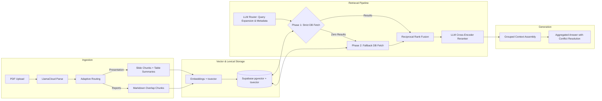

# Vectera.ai RAG System (V3)

This repository contains an enterprise-grade Retrieval-Augmented Generation (RAG) pipeline built to ingest messy financial investment materials (slide decks and long-form reports), store high-dimensional embeddings, and execute citation-aware generation. 

V2 - significantly upgraded to improve retrieval quality beyond vector similarity, implement adaptive chunking, handle version conflicts, and expose retrieval behavior for rigorous evaluation.
V3 - focuses heavily on fault-tolerant retrieval, query expansion, and explicit conflict resolution across different versions of institutional financial data.

## System Architecture

The pipeline consists of a Streamlit frontend and a Python backend, orchestrating LlamaCloud for structural ingestion, Supabase for vector/hybrid storage, and OpenAI for embedding and generation.



**Configuration Defaults:**
- `EMBEDDING_MODEL`: `text-embedding-3-large` (dim=1536)
- `REASONING_MODEL`: `gpt-5.4-mini`
- `TOP_K`: 5 (dynamically scaled to 10 for comparison queries)

## Core Infrastructure & Trade-Offs

### 1. Database, Multi-Tenancy & Scaling Strategy
We use Postgres with `pgvector` and `tsvector` to handle complex metadata filtering and hybrid search.
*   **Row-Level Tenant Isolation:** Client access control is maintained via a strict `client_id` column in the `documents` table, enforced directly through the Postgres RPC.
*   **Scaling Path:** At material scale, exact cosine similarity degrades to full table scans. We rely on an **HNSW (Hierarchical Navigable Small World)** index. If the corpus scales to millions of chunks across hundreds of tenants, the architecture must transition to native Postgres partitioning by `client_id` and implement a batch index update queue to prevent synchronous CPU churn during document uploads.

### 2. Adaptive Chunking by Document Type
Standard open-source RAG systems destroy structured financial data by applying one-size-fits-all character splitters. We extract `document_type` during ingestion and route accordingly.
*   **Presentations:** Slide-level chunks. If a slide contains a table, we use an LLM to generate a dense 3-sentence summary of the metrics for vector embedding, while preserving the raw markdown table for exact numeric grounding.
*   **Financial Reports:** Bounded plain-text chunking (4000 chars, 400 overlap) using LangChain's Markdown splitter. 

### 3. Fault-Tolerant Retrieval & Hybrid Search
We bridge the lexical gap between dense vectors and exact financial metrics using a multi-phase, expanded pipeline.
*   **Query Expansion:** The router generates 3 variations of the user's intent using financial synonyms to maximize recall.
*   **Soft Target Fusion:** Strict SQL filtering leads to catastrophic failures if a user casually refers to a "presentation" as a "report". We apply temporal and document-type filters as a 1.25x multiplicative boost during Reciprocal Rank Fusion (RRF) rather than strict `WHERE` exclusions.
*   **Graceful Degradation (Fallback):** If Phase 1 (strict temporal targeting) yields 0 chunks, the system automatically drops the year and quarter filters and re-queries the database.
*   **LLM Cross-Encoder:** A lightweight reasoning model scores the fused candidates (0 to 10), acting as a precision sniper to filter out noise before generation.

### 4. Forgiving Generation & Conflict Resolution
The system handles multiple versions of the same company's materials (e.g., Q3 vs Q4 guidance) without blindly averaging conflicting metrics.
*   **Context Grouping:** Chunks are hierarchically grouped by `company` and `document_version` before entering the context window.
*   **Single-Pass Reasoning:** The generator prompt detects comparison queries and explicitly instructs the LLM to output Markdown tables and calculate deltas. 
*   **Trade-off:** We use a single-pass `<thinking>` block for speed (Time-To-First-Token < 5s). For massive document families, a true Multi-Agent orchestration (Agent A reads Q3, Agent B reads Q4, Agent C resolves) would be more robust against context limit saturation, but would increase latency.

## Validation & Evaluation
To mathematically validate that retrieval returns the "right" chunks consistently:
*   **Offline Golden Eval:** We run `scripts/evaluate_retrieval.py`, an automated harness that computes Hit Rate@K by verifying if expected `(company, document_version)` tuples, specific page numbers, and exact string substrings appear in top-K results.
*   **UI Debugging:** Streamlit exposes a Debug Mode showing Similarity scores, RRF scores, and Reranker logic per chunk.

## Known Limitations
*   **Synchronous Processing:** The current implementation uses a synchronous `ThreadPoolExecutor` for chunk summarization and blocks the UI during ingestion.
*   **Charts/Visuals:** LlamaCloud inline images are parsed but not converted into VLM-generated alt-text summaries for embedding.
*   **Repetitive Boilerplate:** Many PDFs repeat safe-harbor/disclaimer blocks. Future ingestion should strip repetitive headers/footers before embedding to reduce vector noise.
*   **Strict Company Name Matching:** The LLM extraction currently relies on exact matching for company names. If the user query has a slight variation, it may fail to retrieve documents.

## What I Would Improve With More Time
1.  **Dedicated Reranker API:** Replace the generalized LLM Cross-Encoder prompt with a dedicated reranking model (e.g., Cohere Rerank 3) to reduce token costs and improve latency.
2.  **Entity Resolution (Master Database):** Implement a canonical company name resolution step mapping raw query strings (e.g., "DLR") to standard IDs before DB execution.
3.  **Asynchronous Task Queues:** Decouple the `ingest_pdf` function from the Streamlit frontend using Redis and Celery so users can chat seamlessly while heavy PDFs process in the background.
4.  **RAGAS Evaluation Integration:** Expand the offline evaluation harness beyond simple metadata hits to measure context precision, recall, and groundedness using the RAGAS or TruLens frameworks.

---

## Setup & Run Instructions

1.  Create a Supabase project and enable `pgvector`.
2.  Execute the provided `supabase.sql` in your Supabase SQL editor.
3.  Copy `.env.example` to `.env` and populate your Service/API keys (OpenAI, Supabase, LlamaCloud).

**Install dependencies:**
```bash
uv run pip install -r requirements.txt
```

Run Streamlit app:
```bash
uv run streamlit run app.py
```

Run retrieval evaluation harness:
```bash
uv run python -m scripts.evaluate_retrieval
```

## Demo Questions
Once the app is running and your PDFs are uploaded, try asking:
- "Compare Q3 2025 and Q4 2026 revenue for Digital Realty."
- "What is guidance for 2026 in the Investor Presentation?"
- "Which sources mention the merger timeline?"