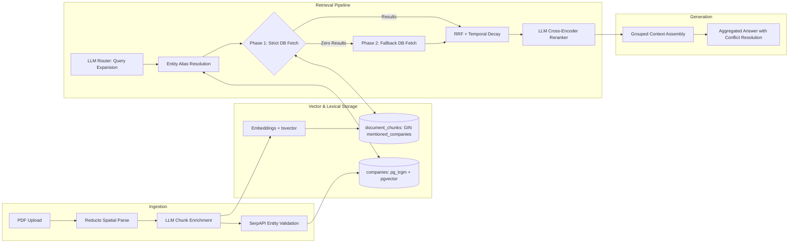

# Vectera.ai RAG System (V4)

This repository contains an enterprise-grade Retrieval-Augmented Generation (RAG) pipeline built to ingest messy financial investment materials (slide decks and long-form reports), store high-dimensional embeddings, and execute citation-aware generation. 

V2: significantly upgraded to improve retrieval quality beyond vector similarity, implement adaptive chunking, handle version conflicts, and expose retrieval behavior for rigorous evaluation.
V3: focuses heavily on fault-tolerant retrieval, query expansion, and explicit conflict resolution across different versions of institutional financial data.
V4 (Current): migrated to Reducto for spatial OCR fidelity, implemented deterministic entity resolution via SerpAPI and `pg_trgm`, added multi-company semantic chunking, and introduced symmetric temporal decay for recency-biased retrieval.

## System Architecture

The pipeline consists of a Streamlit frontend and a Python backend, orchestrating Reducto for structural ingestion, Supabase (Postgres, pgvector, pg_trgm) for hybrid storage, and OpenAI for embedding and generation.



**Configuration Defaults:**
*   `EMBEDDING_MODEL`: `text-embedding-3-large` (dim=1536)
*   `REASONING_MODEL`: `gpt-5.4-mini`
*   `TOP_K`: 5 (dynamically scaled to 10 for comparison queries)

## Core Infrastructure & Trade-Offs

### 1. Database, Multi-Tenancy & Entity Resolution
We use Postgres with `pgvector`, `tsvector`, and `pg_trgm` to handle complex metadata filtering, hybrid search, and deterministic entity resolution.
*   **Row-Level Tenant Isolation:** Client access control is maintained via a strict `client_id` column in the `documents` table, enforced directly through the Postgres RPC.
*   **Entity Alias Resolution (V4):** We maintain a separate `companies` dictionary. Raw user queries are matched against aliases (e.g., "Cube" to "CubeSmart") using a dual-pass `pg_trgm` and `pgvector` lookup before executing the primary document search.
*   **Scaling Path:** At material scale, exact cosine similarity degrades to full table scans. We rely on an **HNSW (Hierarchical Navigable Small World)** index.

### 2. Spatial Chunking & Cross-Company Context
Standard open-source RAG systems destroy structured financial data by applying one-size-fits-all character splitters. We migrated the ingestion engine to Reducto for visual geometry parsing.
*   **Spatial Fidelity (V4):** Reducto accurately preserves nested columns, negative accounting bounds, and superscripts critical for financial dataframes.
*   **Multi-Entity Chunk Enrichment (V4):** Chunks no longer blindly inherit a single company tag. Every chunk is processed by a reasoning model to extract a `mentioned_companies` array, enabling cross-company competitor analysis via GIN-indexed Postgres array overlaps.

### 3. Fault-Tolerant Retrieval & Hybrid Search
We bridge the lexical gap between dense vectors and exact financial metrics using a multi-phase, expanded pipeline.
*   **Query Expansion:** The router generates 3 variations of the user's intent using financial synonyms to maximize recall.
*   **Soft Target Fusion:** Strict SQL filtering leads to catastrophic failures if a user casually refers to a "presentation" as a "report". We apply temporal and document-type filters as a 1.25x multiplicative boost during Reciprocal Rank Fusion (RRF) rather than strict `WHERE` exclusions.
*   **Graceful Degradation (Fallback):** If Phase 1 (strict temporal targeting) yields 0 chunks, the system automatically drops the year and quarter filters and re-queries the database.
*   **LLM Cross-Encoder:** A lightweight reasoning model scores the fused candidates (0 to 10), acting as a precision sniper to filter out noise before generation.

### 4. Forgiving Generation, Lineage, & Conflict Resolution
The system handles multiple versions of the same company's materials (e.g., Q3 vs Q4 guidance) without blindly averaging conflicting metrics.
*   **Symmetric Temporal Decay (V4):** The SQL math applies an absolute recency decay multiplier based on the document's `as_of_date`. Vague queries naturally float the most recent actuals to the top, while symmetrically penalizing historical and future-dated documents.
*   **Context Grouping:** Chunks are hierarchically grouped by `company` and `document_version` before entering the context window.
*   **Single-Pass Reasoning:** The generator prompt detects comparison queries and explicitly instructs the LLM to output Markdown tables and calculate deltas using a `<thinking>` block for speed.

## Validation & Evaluation
To mathematically validate that retrieval returns the "right" chunks consistently:
*   **Offline Golden Eval:** We run `scripts/evaluate_retrieval.py`, an automated harness that computes Hit Rate@K by verifying if expected `(company, document_version)` tuples, specific page numbers, and exact string substrings appear in top-K results.
*   **UI Debugging:** Streamlit exposes a Debug Mode showing Similarity scores, RRF scores, and Reranker logic per chunk.

## Known Limitations
*   **Synchronous Processing:** The current implementation uses a synchronous `ThreadPoolExecutor` for chunk summarization, SerpAPI validation, and blocks the UI during ingestion.
*   **Repetitive Boilerplate:** Many PDFs repeat safe-harbor or disclaimer blocks. Future ingestion should strip repetitive headers or footers before embedding to reduce vector noise.
*   **Reducto Page Isolation:** To guarantee stability and bypass API timeouts, Reducto parses documents page-by-page. This breaks its native capability to merge financial tables that span multiple PDF pages.

## What I Would Improve With More Time
1.  **Dedicated Reranker API:** Replace the generalized LLM Cross-Encoder prompt with a dedicated reranking model (e.g., Cohere Rerank 3) to reduce token costs and improve latency.
2.  **Asynchronous Task Queues:** Decouple the `ingest_pdf` function from the Streamlit frontend using Redis and Celery so users can chat seamlessly while heavy PDFs process in the background.
3.  **RAGAS Evaluation Integration:** Expand the offline evaluation harness beyond simple metadata hits to measure context precision, recall, and groundedness using the RAGAS or TruLens frameworks.

---

## Setup & Run Instructions

1.  Create a Supabase project and enable `pgvector` and `pg_trgm`.
2.  Execute the provided `supabase.sql` in your Supabase SQL editor.
3.  Copy `.env.example` to `.env` and populate your Service/API keys (OpenAI, Supabase, Reducto, SerpAPI).

**Install dependencies:**
```bash
uv run pip install -r requirements.txt
```

Run Streamlit app:
```bash
uv run streamlit run app.py
```

Run retrieval evaluation harness:
```bash
uv run python -m scripts.evaluate_retrieval
```