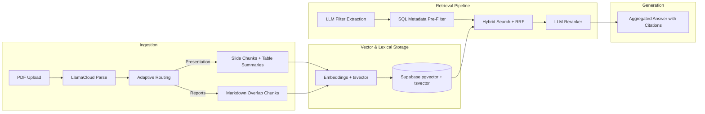

# Vectera.ai RAG System (V2)

This repository contains a specialized Retrieval-Augmented Generation (RAG) pipeline built to ingest messy financial investment materials (slide decks and long-form reports), store high-dimensional embeddings, and execute citation-aware generation. The V2 system has been significantly upgraded to improve retrieval quality beyond vector similarity, implement adaptive chunking, handle version conflicts, and expose retrieval behavior for rigorous evaluation.

## System Architecture

The pipeline consists of a Streamlit frontend and a Python backend, orchestrating LlamaCloud for structural ingestion, Supabase for vector/hybrid storage, and OpenAI for embedding and generation.



**Configuration Defaults:**
- `EMBEDDING_MODEL`: `text-embedding-3-large` (dim=1536)
- `REASONING_MODEL`: `gpt-5.4-mini`
- `TOP_K`: 5 (dynamically scaled to 10 for comparison queries)

## Core Infrastructure & Trade-Offs

### 1. Database, Multi-Tenancy & Scaling Strategy (Supabase)
We use Postgres with `pgvector` and `tsvector` to demonstrate enterprise readiness and handle complex metadata filtering.
*   **The Multi-Tenant Flex:** Client access control is maintained via a strict `client_id` column in the `documents` table, enforced through Postgres RPC (`match_documents`).
*   **Scaling Path:** At material scale (millions of chunks), exact cosine similarity degrades to full table scans. We rely on an **HNSW (Hierarchical Navigable Small World)** index in pgvector to keep latency low. If corpus size and tenant count grow significantly, three architectural additions become critical:
    1.  **Native partitioning** by `client_id` to avoid global table scans.
    2.  **Supabase Row Level Security (RLS)** to enforce isolation at the DB authentication layer.
    3.  **Batch index update queue** for HNSW maintenance, avoiding synchronous index churn on every upload.

### 2. Adaptive Chunking by Document Type
Standard open-source RAG systems destroy structured financial data by applying one-size-fits-all character splitters. We extract `document_type` during ingestion and route accordingly:
*   **Presentations:** Slide-level chunks. If a slide contains a table, we use an LLM to generate a dense 3-sentence summary of the metrics for vector embedding, while preserving the raw markdown table for exact numeric grounding during generation.
*   **Financial Reports:** Bounded plain-text chunking (4000 chars, 400 overlap) using LangChain's Markdown splitter. This prevents the failure mode where a full 50-page report is passed through a "summarize slide" path.

### 3. 3-Stage Retrieval Pipeline
To improve retrieval quality beyond straightforward vector similarity, we bridge the lexical gap between dense vectors and exact financial metrics:
*   **Stage 1 (Metadata Extraction):** An LLM parses the user query to extract exact metadata filters (`report_year`, `report_quarter`, `company_name`). We currently use exact matching (`=`) for company names.
*   **Stage 2 (Hybrid Search + RRF):** We combine dense semantic vectors (cosine similarity) with Postgres full-text keyword search (`tsvector`), merging results using Reciprocal Rank Fusion (RRF). This catches exact names and version labels while keeping semantic recall. *(Tradeoff: Each branch caps candidates at 100 before fusion. In production, fusion should move closer to the engine layer to avoid early truncation.)*
*   **Stage 3 (LLM Reranking):** A lightweight reasoning model acts as a relevance judge. It reads the top candidate payloads and passes only the most strictly relevant chunks to the final generation model.

## Handling Real-World Complexity

### Version Awareness & Conflict Resolution
The system is explicitly designed to handle multiple versions of the same company's materials without blindly averaging conflicting metrics.
*   **Indexing Strategy:** We extract `report_year`, `report_quarter`, and `document_version` at ingestion. At retrieval, the SQL `WHERE` clause applies LLM-extracted filters *before* vector math. This prevents mixing 2025/Q3 and 2026/Q4 data in the same context window unintentionally.
*   **Comparison Queries:** For explicit comparisons (e.g., "compare Q3 and Q4"), the retrieval dynamically broadens recall (threshold dropped to `0.0` and fetch count doubled).
*   **Generation Constraints:** The generation model is explicitly prompted to present conflicts directly (e.g., "Source A says X. Source B says Y") rather than averaging conflicting numbers.

### Retrieval Evaluation & Validation
To validate that retrieval is returning the "right" chunks consistently:
*   **UI Debugging:** Streamlit exposes a Debug Mode showing Similarity and RRF scores per chunk.
*   **Offline Golden Eval:** We include `scripts/evaluate_retrieval.py`, an automated harness that computes Hit Rate@K by checking whether expected `(company, document_version)` tuples appear in top-K results.
*   **"Lost in the Middle" Mitigation:** Large Language Models often suffer from 'Lost in the Middle' syndrome, where they ignore context placed in the center of a long prompt. To counter this, the generator.py implements a chunk reordering algorithm that places the highest-scoring retrieved chunks at the very beginning and very end of the context window, ensuring the LLM pays attention to the most critical data.
*   **Concurrency / Latency Optimization:** To keep retrieval latency low, the system concurrently executes the OpenAI vector embedding request and the LLM query filter extraction (extract_query_filters) using a ThreadPoolExecutor.

## Known Limitations

*   **Synchronous Processing:** The current implementation uses a synchronous `ThreadPoolExecutor` for chunk summarization and blocks the UI during ingestion.
*   **Charts/Visuals:** LlamaCloud inline images are parsed but not converted into VLM-generated alt-text summaries for embedding.
*   **Repetitive Boilerplate:** Many PDFs repeat safe-harbor/disclaimer blocks. Future ingestion should strip repetitive headers/footers before embedding to reduce vector noise.
*   **Strict Company Name Matching:** The LLM extraction currently relies on exact matching for company names. If the user query has a slight variation, it may fail to retrieve documents.

## What I Would Improve With More Time

1.  **Entity Resolution (Master Database):** Implement a canonical company name resolution step. After extracting the raw company name from the user query, cross-reference it against a master database (e.g., mapping "Digital Realty" or "DLR" to a canonical standard ID) before passing it to the `match_documents` RPC.
2.  **Multi-Turn Conversational State:** Build a Query Contextualization pipeline to rewrite conversational fragments into standalone, context-complete search queries.
3.  **LLM-as-a-Judge Evaluation:** Expand the offline evaluation harness to include metrics for context precision, recall, and groundedness (e.g., RAGAS/TruLens) beyond simple metadata hits.
4.  **Asynchronous Task Queues:** Decouple ingestion from the frontend using a message broker (Redis) and background workers (Celery/FastAPI) so users can chat while documents ingest.

---

## Setup & Run Instructions

1.  Create a Supabase project and enable `pgvector`.
2.  Execute the provided `supabase.sql` in your Supabase SQL editor.
3.  Copy `.env.example` to `.env` and populate your Service/API keys (OpenAI, Supabase, LlamaCloud).

**Install dependencies:**
```bash
uv run pip install -r requirements.txt
```

Run Streamlit app:
```bash
uv run streamlit run app.py
```

Run retrieval evaluation harness:
```bash
uv run python -m scripts.evaluate_retrieval
```

## Demo Questions
Once the app is running and your PDFs are uploaded, try asking:
- "Compare Q3 2025 and Q4 2026 revenue for Digital Realty."
- "What is guidance for 2026 in the Investor Presentation?"
- "Which sources mention the merger timeline?"